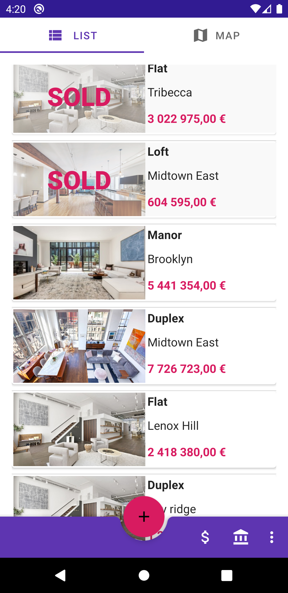
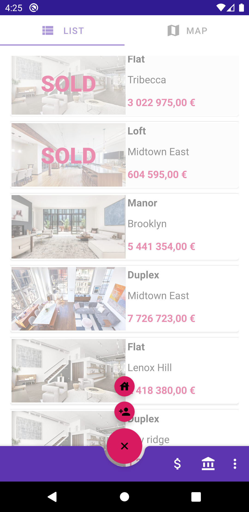
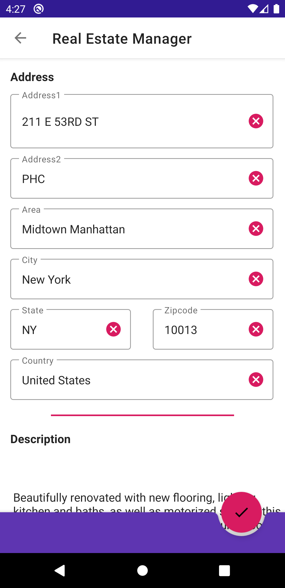
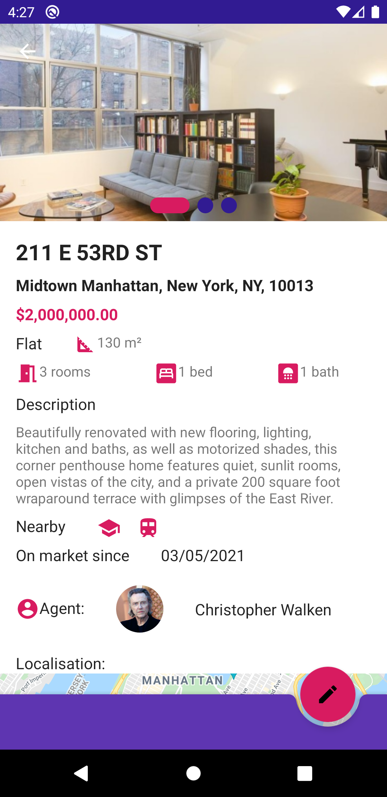
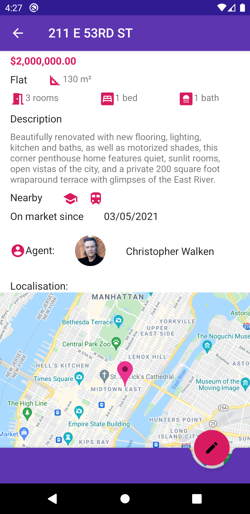
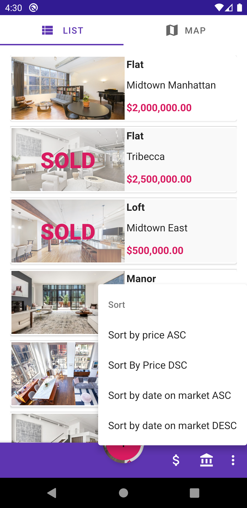
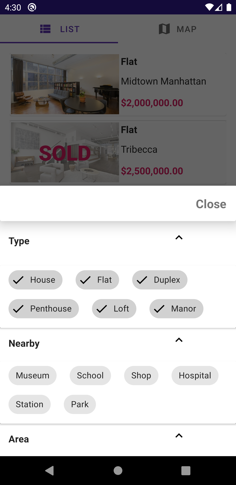
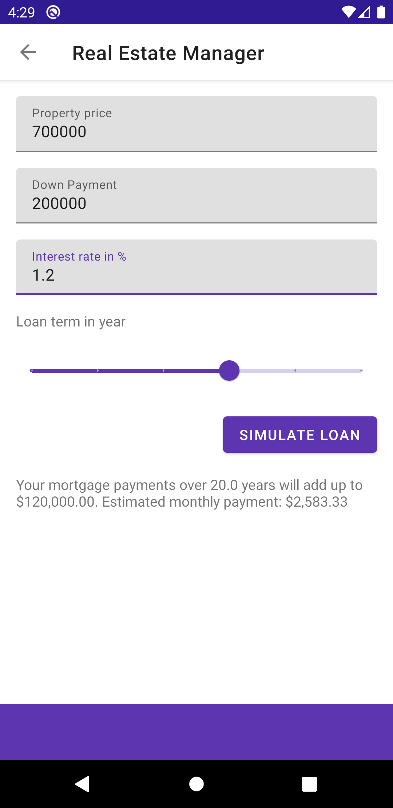

# Real Estate Manager

This repository contains a mini-application for the P9 of the Grande École du Numérique pathway.

## Introduction

The **Real Estate Manager** app allow agents to access files of different real estate from their mobile equipment. The app is completely offline. You can create new estate and assign agent created.You can see all estate around you in the map view. App is multi currency view. You can also simulate a loan.

## Interface preview
 
  
    

 
## Getting Started
1. Download the project code, preferably with git clone.
2. Open Android Studio and click on "Check out project from Version Control" and click on Git.
3. Paste the url of the git repository in the "URL" field.
4. If necessary, modify the repository installation folder in the "Directory" field.
5. Synchronize the project with Gradle if necessary by clicking on the elephant icon.
6. A Google Maps api key is necessary to run teh app. You will have to register ig you don't have one.
7. Add your Google Map Api key in gradle.properties
8. Add gradle.properties in .gitignore file
9. Add a project
10. Compile the project by clicking on the hammer icon.
11. If necessary, select an android device and launch the project by clicking on the green arrow icon.
12. Enjoy the project and don't hesitate to contribute or report a bug on the project's Github repository.

## Built With
- [Kotlin](https://kotlinlang.org/) - A modern programming language that makes developers happier. :)
- [Hilt](https://developer.android.com/training/dependency-injection/hilt-android) - Dependency injection library for Android
- [Coroutines](https://kotlinlang.org/docs/coroutines-overview.html#tutorials) - For asynchronous
- [StateFlow](https://developer.android.com/kotlin/flow/stateflow-and-sharedflow) - StateFlow is a state-holder observable flow that emits the current and new state updates to its collectors. 
- [Google Maps Android KTX](https://developers.google.com/maps/documentation/android-sdk/ktx?hl=fr) - - Maps Android KTX is a collection of Kotlin extensions for the Maps SDK for Android and the Maps SDK for Android Utility Library. These extensions provide Kotlin language features that enable you to write concise and idiomatic.
- [Android Navigation Components](https://developer.android.com/topic/libraries/architecture) : Android Jetpack's Navigation component helps you implement navigation, from simple button clicks to more complex patterns, such as app bars and the navigation drawer. 
- [Android Architecture Components](https://developer.android.com/topic/libraries/architecture) : 
  - [ViewModel](https://developer.android.com/topic/libraries/architecture/viewmodel) to stores UI-related data that isn't destroyed on app rotations.
  - [ViewBinding](https://developer.android.com/topic/libraries/view-binding) to generates a binding class for each XML layout file present in that module.
  - [DataBinding](https://developer.android.com/topic/libraries/data-binding) to to bind UI components in your layouts to data sources in your app using a declarative format rather than programmatically.
- [Notification](https://developer.android.com/training/notify-user/build-notification)- Provide short, timely information about events in your app while it's not in use.
- [Localization](https://developer.android.com/guide/topics/resources/localization) - English
- [Espresso](https://developer.android.com/training/testing/ui-testing/espresso-testing) - Provides APIs for writing UI tests to simulate user interactions within a single target app.

